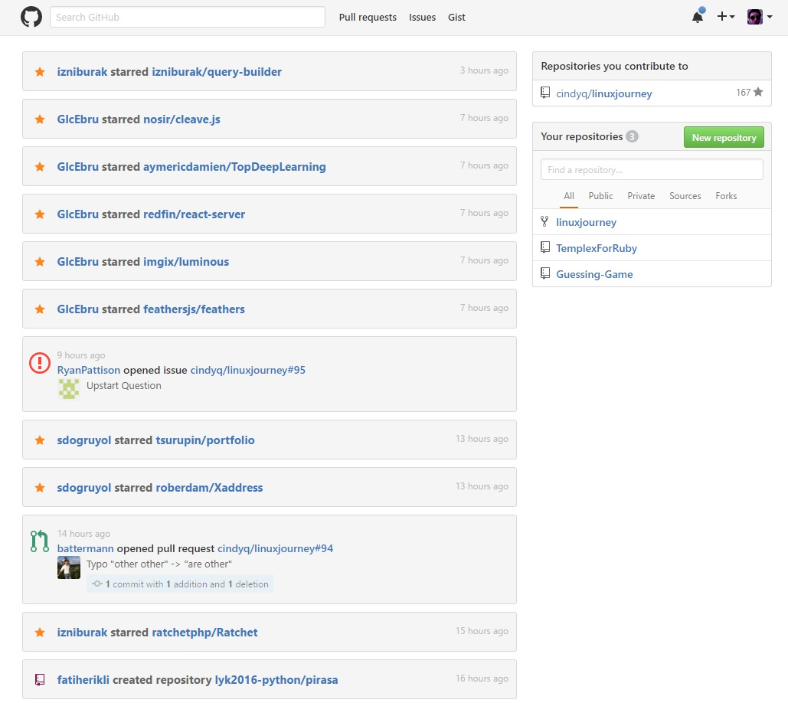

# EyeFriendly Github Dashboard

Love Your Eyes! Custom CSS For Github Dashboard.

## Preview

## Installing

* For Stylish Addon:
  * Get the Stylish addon for [Firefox](https://addons.mozilla.org/en-US/firefox/addon/2108/), [Chrome](https://chrome.google.com/extensions/detail/fjnbnpbmkenffdnngjfgmeleoegfcffe), [Opera](https://addons.opera.com/en/extensions/details/stylish/), [Safari](http://sobolev.us/stylish/) and [Firefox Mobile](https://addons.mozilla.org/en-US/firefox/addon/2108/).
  * Then install this style using:
    * Go [userstyles.org](http://userstyles.org/styles/131357) and click "Install with Stylish" button.
    * or, add [style.css](https://raw.githubusercontent.com/uCibar/EyeFriendly-Dashboard/master/style.css) manually into the stylish addon editor.

## Contributions

If you would like to contribute to this repository;

1. Fork
2. Make changes
3. Create a pull request!
